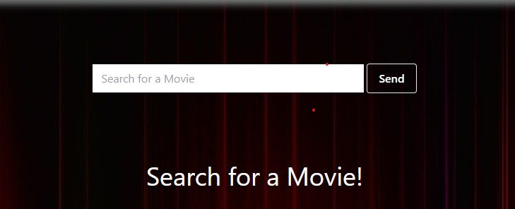

## Movie List
This is an application that searches for movies or shows using the OMDB API .
The user types a title in the search box and clicks send
When the user hits sends data is retrieved from OMDB which retrieves a search and looks for a match

If a match is found then the results display under **movies**
If no results are found then a message displays "No movies found, search again

If the user wants they can add their favorite movies to a **favorites** list below by hovering over the image of the movie and clicking "add"
This favorites is stored in Firebase, so if the user reloads the page the favorites will still display in the application

In the favorites list the user can delete a favorite by hovering over the image and clicking "delete"

Some of the resources I used for creating this application are below.
Firebase with React.JS https://www.youtube.com/watch?v=2hR-uWjBAgw
Tailwind CSS scrollbar  https://www.youtube.com/watch?v=x4bom6Udk_4
Passing Props in React https://medium.com/@kkm2059/how-to-use-and-pass-functions-as-props-react-ff677f5bca0b
How to pass child to parent React https://www.youtube.com/watch?v=UrpNtB61qyo&t=3s

The Technologies used were:
CSS, React, Firebase, Tailwind CSS, OMDB API

