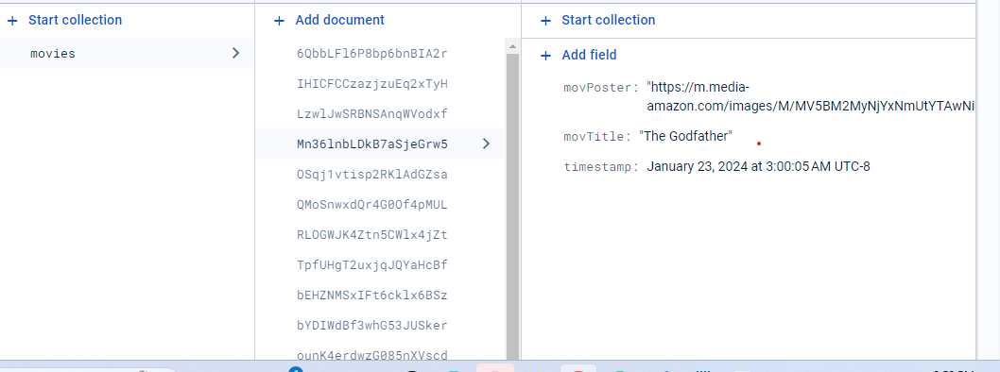

## Movie List
https://movie-favorites-d8693.web.app/

This is an application that searches for movies or shows using the OMDB API .
The user types a title in the search box and clicks send. If the user clicks send then the data is retrieved from OMDB API. 

If a match is found in the OMDBI then the results display under **movies.** The results are limited to 10. If no results are found then a message displays 
> No movies found, search again

If the user wants they can add their favorite movies to a **favorites** list by hovering over the image of the movie and clicking "add." The banner above lets the user know if the favorite is added. If a movie has been added to favorites then a heart icon will display on the movie poster. The user can attempt to add a movie twice to their favorites, but will be prevented from doing this action. A banner message will appear warning the user that the movie has been already added

The favorites are stored in Firebase which saves the title, poster, and timestamp

If the user reloads the page the favorites will still display in the application

In the favorites list the user can delete a favorite by hovering over the image and clicking "delete." This deletes the movie from the application in the favorites and also from Firebase. The heart icon will also be removed from the movie image in the **Movies** list.

Some of the resources I used for creating this application are below.

- Firebase with React.JS https://www.youtube.com/watch?v=2hR-uWjBAgw
- Tailwind CSS scrollbar  https://www.youtube.com/watch?v=x4bom6Udk_4
- Passing Props in React https://medium.com/@kkm2059/how-to-use-and-pass-functions-as-props-react-ff677f5bca0b
- How to pass child to parent React https://www.youtube.com/watch?v=UrpNtB61qyo&t=3s

The Technologies used were:
CSS, React, Firebase, Tailwind CSS, OMDB API

